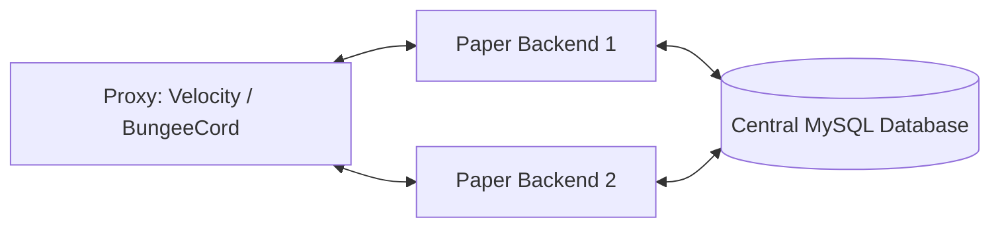

<div align="center">

# ReportSystem

**Next-Generation Visual Replay, Overwatch Review & Player Moderation System for Minecraft**

[](https://www.oracle.com/java/)
[](https://papermc.io/)
[](https://github.com/retrooper/packetevents)
[](https://github.com/KAREBLOK/ReportSystem/releases)
[](LICENSE)
[](https://discord.com/invite/WZc5bE9cK8)

[Türkçe Dökümantasyon için tıklayın (README_tr.md)](README_tr.md)

</div>

---

## Overview

**ReportSystem** is a modern, high-performance moderation and reporting ecosystem engineered from the ground up for modern Minecraft networks (Paper, Purpur, Velocity, BungeeCord).

Instead of relying on ambiguous text logs or easily falsified chat screenshots, ReportSystem captures **frame-accurate packet replays** of suspect behavior at the moment of reporting. Integrated with a **community-driven Overwatch system** inspired by CS:GO, automatic anti-cheat recording triggers, interactive GUI panels, and multi-channel notifications, it provides server administrators with complete visibility over server fair-play.

---

## Table of Contents

- [Key Features](#key-features)
- [System Requirements](#system-requirements)
- [Installation Guide](#installation-guide)
  - [Standalone Server (Paper)](#standalone-server-paper)
  - [Proxy Network (Velocity / BungeeCord)](#proxy-network-velocity--bungeecord)
- [Core Systems](#core-systems)
  - [1. Visual Replay Engine](#1-visual-replay-engine)
  - [2. Overwatch Community Review](#2-overwatch-community-review)
  - [3. Interactive NPC System](#3-interactive-npc-system)
  - [4. Punishment System & Animated Ban](#4-punishment-system--animated-ban)
  - [5. Smart Anti-Cheat Integration](#5-smart-anti-cheat-integration)
  - [6. Multi-Channel Notifications](#6-multi-channel-notifications)
  - [7. Discord Webhook Integration](#7-discord-webhook-integration)
- [Configuration Reference](#configuration-reference)
- [Commands & Aliases](#commands--aliases)
- [Permissions Reference](#permissions-reference)
- [PlaceholderAPI Placeholders](#placeholderapi-placeholders)
- [Performance & Optimization](#performance--optimization)
- [Troubleshooting & FAQ](#troubleshooting--faq)
- [Support & Community](#support--community)

---

## Key Features

- **Frame-Accurate Visual Replay:** Records over **53+ packet action types** (movement, combat, head rotations, sneaking, swimming, elytra flight, projectile trajectories, and block interactions).
- **Hotbar Replay Controls:** In-game controller items to Play, Pause, Fast-Forward (+10s), Rewind (-10s), adjust speed (0.25x to 2x), and teleport directly to suspects.
- **Overwatch Review System:** Empower trusted players to watch anonymized replays, analyze evidence, and cast votes with XP progression, ranks, and accuracy ratings.
- **Open Community Voting (v2.1.5):** Flexible voting where any qualified player can review cases, while moderators hold final verdict authority or let the queue resolve automatically.
- **Animated Ban Spectacle:** Ban cheaters with lightning strikes, falling anvils, frozen movement, and custom global death alerts.
- **Anti-Cheat Hooks:** Native smart-scoring listeners for **Polar**, **Vulcan**, and **GrimAC**. Automatically records and queues suspects upon suspicious heuristic spikes.
- **Multi-Channel Alerts:** Staff notifications via interactive Toasts (Advancement popups), Screen Titles, Actionbar tickers, custom sounds, and clickable chat messages.
- **Proxy & Cross-Server Sync:** Full compatibility with BungeeCord and Velocity networks with centralized MySQL / HikariCP pooling.
- **PlaceholderAPI Integration:** Expose report counts, trust factors, Overwatch XP, ranks, and review stats on Scoreboards and TAB menus.
- **Discord Webhooks:** Embed notifications with color coding, player avatars, and interactive buttons for new reports, verdicts, and punishments.

---

## System Requirements

| Component | Minimum Requirement | Recommended |
| :--- | :--- | :--- |
| **Platform** | Paper 1.21+ (Purpur, Folia, Pufferfish) | Latest Paper 1.21.x |
| **Java** | Java 21 | Java 21+ |
| **PacketEvents** | **v2.11.2+ (MANDATORY)** | Latest 2.x Release |
| **Database** | SQLite (Built-in for single server) | MySQL 8.0+ / MariaDB 10.5+ (HikariCP) |
| **Proxy (Optional)** | BungeeCord or Velocity 3.3+ | Velocity 3.3+ |

> [!IMPORTANT]
> **PacketEvents is strictly required.** The Replay recording and playback engine depends directly on PacketEvents packet wrappers. The plugin will disable itself safely if PacketEvents is absent.

---

## Installation Guide

### Standalone Server (Paper)

1. Download `ReportSystem-v2.1.5.jar` and `packetevents-spigot.jar`.
2. Place both JAR files into your server's `plugins/` directory.
3. Start the server once to generate default configuration files and SQLite storage.
4. Customize `plugins/ReportSystem/config.yml` and `messages_en.yml` (or `messages_tr.yml`).
5. Restart your server or run `/rs reload`.

### Proxy Network (Velocity / BungeeCord)



1. **Backend Servers (Paper):**
   - Install `ReportSystem.jar` + `packetevents.jar` into each backend server's `plugins/` folder.
   - In `plugins/ReportSystem/config.yml`:
     - Set `database.type: "mysql"`
     - Configure your centralized MySQL credentials (`host`, `port`, `database`, `username`, `password`).
     - Set a unique identifier: `general.server-name: "survival-1"` (or "bedwars-1", etc.).
2. **Proxy Server:**
   - Place `ReportSystem.jar` into `plugins/` on your Velocity or BungeeCord proxy.
   - Configure MySQL credentials in the proxy config to allow network-wide report sync.
3. Restart the entire network.

---

## Core Systems

### 1. Visual Replay Engine

The replay engine is powered by virtual NPC packets and local chunk data caching. It accurately reproduces suspect behavior without modifying actual world blocks or interfering with living entities.

#### 53+ Recorded Action Types
- **Movement & Physics:** Precise X/Y/Z positions, yaw, pitch, head rotation, sneaking, sprinting, swimming, jumping, crawling, gliding (elytra).
- **Combat & Weapons:** Left-click swings, melee hits, critical hits, bow pull/charge/release, crossbow loading, shield blocking, totem of undying pops.
- **Inventory & Items:** Item switching, armor equipping, offhand swaps, item drops, pickups, eating food, drinking potions.
- **World Interaction:** Block break animations, block placement, chest/container opening, anvil usage, enchanting tables.
- **Vehicle & Riding:** Mounting horses/boats/minecarts, steering, dismounting.
- **Lifecycle & Status:** Damage animations, potion effects, burning, extinguishing, death, respawn, world switching, gamemode switching.

#### In-Game Hotbar Controls
When playing a replay, the reviewer's inventory is equipped with intuitive replay control items:

```
[ Slot 1 ]  Pause / Resume
[ Slot 2 ]  Rewind (-10 Seconds)
[ Slot 3 ]  Fast Forward (+10 Seconds)
[ Slot 4 ]  Exit Replay
[ Slot 5 ]  Speed Control (0.25x | 0.5x | 1.0x | 1.5x | 2.0x)
[ Slot 6 ]  Teleport to Suspect
[ Slot 8 ]  Replay Settings (Show hitboxes, trails, nearby players)
```

---

### 2. Overwatch Community Review

Inspired by Counter-Strike's Overwatch, ReportSystem empowers trusted community members to inspect anonymized replays and cast verdicts on reported players.

#### Progression & Ranks

| Rank | Required XP | Accuracy Requirement | Privileges |
| :--- | :--- | :--- | :--- |
| **BRONZE** | `0 - 499 XP` | - | Standard queue access |
| **SILVER** | `500 - 1,499 XP` | - | Priority queue assignments |
| **GOLD** | `1,500 - 3,499 XP` | 75%+ accuracy | Higher vote weight multiplier |
| **DIAMOND** | `3,500+ XP` | 85%+ accuracy | Expedited case processing & custom rewards |

- **Anonymization:** Suspect and reporter names can be hidden (e.g. `The Suspect #842`) to eliminate review bias.
- **Dynamic Scoring:** Players earn XP for correct verdicts. Submitting false verdicts or spamming degrades their reviewer score.
- **Open Community Voting (v2.1.5):** Servers can enable open voting (`auto-complete-queue: false`), allowing the community to vote on cases while staff inspect statistics in `/reports` and issue the final ruling.

---

### 3. Interactive NPC System

Deploy interactive Overwatch NPCs in your hubs or lobbies using PacketEvents virtual entities:

- **Persistent:** Stored in database; safely restored across server reboots.
- **Customizable:** Change player skins, nametags, and floating text holograms.
- **Living Behavior:** NPCs dynamically look at nearby players as they walk past.

```bash
/overwatch npc create &b&lOVERWATCH &7(Click)
/overwatch npc skin Steve
/overwatch npc look true
/overwatch npc move
/overwatch npc delete <id>
```

---

### 4. Punishment System & Animated Ban

Supports standalone bans/mutes as well as direct hooks into **LiteBans** and **AdvancedBan**.

#### The Animated Ban Experience
Punish blatant cheaters with a visual sequence:
1. The suspect is locked and frozen in place.
2. An anvil falls from high sky onto their head.
3. Thunder and lightning strike the exact location.
4. A custom broadcast is shown to all server players, followed by instant disconnection.

> [!NOTE]
> Animated ban requires the target player to be online. If offline, a standard punishment is executed immediately.

---

### 5. Smart Anti-Cheat Integration

ReportSystem integrates with anti-cheat solutions to automatically record and report cheaters:

```
[Anti-Cheat Flag] -> [Suspicion Score Accrues] -> [Threshold Exceeded] -> [Auto-Record 30s + Queue Overwatch + Discord Alert]
```

- **Supported Engines:**
  - **Polar Anti-Cheat:** Detects combat ML, movement, reach, mitigation events.
  - **Vulcan Anti-Cheat:** 35+ check types (KillAura, Scaffold, Speed, Flight). Requires `settings.enable-api: true`.
  - **GrimAC:** Deep packet prediction physics simulation.
- **Decay System:** Suspicion score decays by 50% every 60 seconds to eliminate false positives from lag spikes.

#### Suspicion Weight Matrix
| Check Category | Suspicion Score | Description |
| :--- | :--- | :--- |
| **Cloud Combat Behavior** | `+0.50` | Machine-learning combat anomaly (Polar ML) |
| **Auto Clicker** | `+0.45` | Inhuman CPS consistency & pattern detection |
| **KillAura** | `+0.40` | Multi-target angle snaps and combat packet abuse |
| **Scaffold** | `+0.35` | Inhuman bridging rotations and block placement |
| **Reach** | `+0.30` | Hits exceeding vanilla reach limits |
| **Flight** | `+0.15` | Vertical movement abnormalities |
| **Speed** | `+0.10` | Horizontal velocity violations |
| **Movement / Lag** | `+0.05` | Minor positional inconsistencies |

---

### 6. Multi-Channel Notifications

Staff members can receive alerts through multiple channels:

- **Toast Popup:** Advancement-style notification in the top-right corner.
- **Title Screen:** Headline and subtitle across the center of the display.
- **Action Bar:** Continuous non-intrusive notification above the hotbar.
- **Custom Audio:** Configurable sound alerts (pitch/volume).
- **Interactive Chat:** Clickable JSON messages with hover details (`[Teleport]`, `[Review]`).

---

### 7. Discord Webhook Integration

Synchronize in-game activity directly with your Discord staff channels:

- **Embed Messages:** Color-coded for New Reports (Gold), Replay Completed (Blue), Punishments (Red), and Verdicts (Green).
- **Interactive Buttons:** Direct review links and management shortcuts.
- **Multi-Language:** Adapts dynamically to your configured server language.

---

## Configuration Reference

### config.yml Snippet

```yaml
general:
  language: "en"               # en (English) or tr (Turkish)
  server-name: "survival-1"    # Unique server identifier for network sync
  check-updates: true

database:
  type: "sqlite"               # "sqlite" or "mysql"
  sqlite:
    file: "reports.db"
  mysql:
    host: "localhost"
    port: 3306
    database: "reportsystem"
    username: "root"
    password: "password"
    pool:
      maximum-pool-size: 10
      minimum-idle: 5
      connection-timeout: 30000

reports:
  cooldown-seconds: 60
  max-pending-per-player: 3
  reasons:
    - "KillAura"
    - "Fly / Speed"
    - "Scaffold"
    - "X-Ray"
    - "Chat Toxicity"
  notifications:
    notify-staff: true
    title-enabled: true
    actionbar-enabled: true
    sound-enabled: true
    sound: "ENTITY_EXPERIENCE_ORB_PICKUP"

replay:
  enabled: true
  auto-record: true
  duration-seconds: 45
  auto-delete-days: 7
  max-recordings: 5
  nearby-player-tracking:
    enabled: true
    radius: 16
    interval-ticks: 3
    movement-threshold: 0.05

overwatch:
  enabled: true
  auto-complete-queue: false   # v2.1.5: Set false for open community voting
  required-reviews: 3          # Votes required to complete when auto-complete is true
  anonymize-names: true
  rewards:
    xp-correct: 50
    xp-incorrect: -20
```

---

## Commands & Aliases

### Player & Staff Commands
| Command | Aliases | Permission | Description |
| :--- | :--- | :--- | :--- |
| `/report <player> [reason]` | `/sikayet` | `reportsystem.report` | Opens report creation GUI or files report |
| `/reports` | `/raporlar` | `reportsystem.reports` | Opens staff report management panel |
| `/overwatch` | `/ow` | `reportsystem.overwatch` | Opens community Overwatch review menu |
| `/overwatch stats [player]` | `/ow stats` | `reportsystem.overwatch.stats` | Displays Overwatch level, XP & accuracy |
| `/overwatch queue` | `/ow queue` | `reportsystem.overwatch.queue` | Displays cases waiting for review |
| `/overwatch top` | `/ow top` | `reportsystem.overwatch.top` | Opens top reviewers leaderboard |
| `/overwatch history` | `/ow history` | `reportsystem.overwatch.history` | View your past review verdicts |

### Administrator Commands
| Command | Permission | Description |
| :--- | :--- | :--- |
| `/reportsystem reload` | `reportsystem.admin` | Reloads configurations and language files |
| `/reportsystem stats` | `reportsystem.admin` | View server-wide report & replay statistics |
| `/reportsystem delete <id>` | `reportsystem.delete` | Permanently deletes a specific report & replay |
| `/reportsystem deleteall` | `reportsystem.admin` | Clears all stored reports and replays |
| `/reportsystem purge <days>` | `reportsystem.admin` | Purges reports and replays older than X days |
| `/reportsystem debug` | `reportsystem.admin` | Toggles detailed debug logging in console |
| `/reportsystem verdict <id> <verdict>` | `reportsystem.punish` | Staff resolution for community report votes |
| `/overwatch addqueue <reportId>` | `reportsystem.admin` | Manually push a report to the review queue |
| `/overwatch npc <create/delete/skin/look/move/name/select>` | `reportsystem.overwatch.npc` | Manages Overwatch lobby NPCs |

---

## Permissions Reference

```
reportsystem.use                   # Default: true  - Access basic system functions
reportsystem.report                # Default: true  - Permission to report players
reportsystem.reports               # Default: op    - Open staff report dashboard
reportsystem.view                  # Default: op    - View detailed report information
reportsystem.view.other            # Default: op    - View other staff members' reports
reportsystem.delete                # Default: op    - Delete reports & replays
reportsystem.punish                # Default: op    - Issue punishments through GUI
reportsystem.admin                 # Default: op    - Full administrative controls
reportsystem.bypass                # Default: false - Exemption from being reported
reportsystem.notify                # Default: op    - Receive incoming report alerts
reportsystem.overwatch             # Default: true  - Access Overwatch system
reportsystem.overwatch.review      # Default: true  - Watch replays & submit verdicts
reportsystem.overwatch.stats       # Default: true  - View personal reviewer stats
reportsystem.overwatch.stats.other # Default: op    - View other players' stats
reportsystem.overwatch.top         # Default: true  - View reviewer leaderboards
reportsystem.overwatch.history     # Default: true  - View past personal verdict history
reportsystem.overwatch.queue       # Default: op    - View all queue entries
reportsystem.overwatch.npc         # Default: op    - Manage lobby NPCs
reportsystem.overwatch.admin       # Default: op    - Administer Overwatch cases
```

---

## PlaceholderAPI Placeholders

| Placeholder | Output Example | Description |
| :--- | :--- | :--- |
| `%reportsystem_reports%` | `14` | Total reports received by the player |
| `%reportsystem_trust_level%` | `Good` | Player trust rating (Excellent, Good, Moderate, Poor, Critical) |
| `%reportsystem_trust_points%` | `0` | Violation penalty points (decays over time) |
| `%reportsystem_overwatch_rank%` | `GOLD` | Reviewer rank (BRONZE, SILVER, GOLD, DIAMOND) |
| `%reportsystem_overwatch_level%` | `12` | Reviewer progression level |
| `%reportsystem_overwatch_xp%` | `1850` | Current reviewer experience points |
| `%reportsystem_overwatch_reviews%` | `47` | Total cases evaluated by player |
| `%reportsystem_overwatch_accuracy%`| `91.4%` | Verdict accuracy percentage (unlocked at 50+ reviews) |

---

## Performance & Optimization

ReportSystem is architected for zero-tick-drop operation on production servers:

- **Asynchronous I/O:** Every database query (SQLite/MySQL) and disk write is dispatched on separate worker threads. `performance.async-database: true` guarantees zero main-thread blocking.
- **Smart Memory Cache:** Reports and active queue entries are kept in an LRU memory cache (`performance.cache.max-size: 100`, `expiry: 10m`), eliminating repeated SQL reads when paging through GUIs.
- **Optimized Replay Storage:** Average 45-second recordings occupy just **50–200 KB**. 100 daily reports generate under 20 MB of data.
- **Movement Delta Caching:** `movement-threshold: 0.05` filters micro-jitter from packet streams, shrinking replay file sizes by **40–60%** without noticeable loss of visual fidelity.

---

## Troubleshooting & FAQ

### Frequently Asked Questions

<details>
<summary><b>Does ReportSystem work without PacketEvents?</b></summary>
<br>
<b>No.</b> PacketEvents is a mandatory core dependency. Without it, the packet recording and playback engine cannot bind to the network pipeline.
</details>

<details>
<summary><b>Can two moderators watch the same replay at the same time?</b></summary>
<br>
<b>Yes.</b> All replay entities and particles are client-side virtual packets sent individually to the observer. Observers do not collide or interfere with one another.
</details>

<details>
<summary><b>Do replay arrows or potion splashes hurt real players?</b></summary>
<br>
<b>No.</b> All projectiles and particles spawned during replay sessions are synthetic packets. They cause zero real damage and cannot modify blocks.
</details>

<details>
<summary><b>Do Overwatch NPCs disappear after a server reboot?</b></summary>
<br>
<b>No.</b> All NPC locations, skins, and rotation parameters are stored in the database and automatically respawned when chunks load.
</details>

### Common Issues

- **Plugin fails to load:**
  - Verify Java version (`java -version` must be 21 or higher).
  - Verify PacketEvents is installed and matches your server version.
- **Replay won't record:**
  - Ensure `replay.auto-record: true` is set in `config.yml`.
  - Check that the server has write permissions in `plugins/ReportSystem/replays/`.
- **Database Connection Refused:**
  - Verify MySQL host, port, credentials, and check if your database server allows incoming connections through the firewall.

---

## Support & Community

- **Discord Server:** [discord.gg/WZc5bE9cK8](https://discord.com/invite/WZc5bE9cK8)
- **Issue Tracker:** Report bugs and feature requests on [GitHub Issues](https://github.com/KAREBLOK/ReportSystem/issues)
- **Website:** [kareblok.tc](https://kareblok.tc)

---

<div align="center">
ReportSystem is engineered and maintained by <b>KAREBLOK</b>.<br>
Licensed under the <a href="LICENSE">MIT License</a>.
</div>
