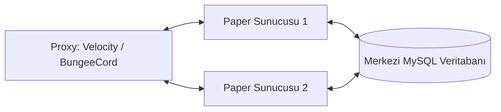

<div align="center">

# ReportSystem

**Minecraft Sunucuları İçin Yeni Nesil Görsel Replay, Overwatch İnceleme ve Oyuncu Moderasyon Sistemi**

[](https://www.oracle.com/java/)
[](https://papermc.io/)
[](https://github.com/retrooper/packetevents)
[](https://github.com/KAREBLOK/ReportSystem/releases)
[](LICENSE)
[](https://discord.com/invite/WZc5bE9cK8)

[Click here for English Documentation (README.md)](README.md)

</div>

---

## Genel Bakış

**ReportSystem**, modern Minecraft ağları (Paper, Purpur, Velocity, BungeeCord) için sıfırdan yüksek performans odaklı olarak geliştirilmiş kapsamlı bir raporlama ve oyuncu denetim ekosistemidir.

Eski usul, yetersiz metin logları veya kolayca taklit edilebilen sohbet ekran görüntüleri yerine ReportSystem; rapor anında şüphelinin hareketlerini **kare kare paket seviyesinde kaydeden Replay sistemi**, CS:GO tarzı **topluluk destekli Overwatch inceleme mekanizması**, hile tespitinde otomatik tetiklenen anti-cheat kancaları, etkileşimli GUI menüleri ve çok kanallı bildirim sistemiyle sunucu yönetiminize tam kontrol sağlar.

---

## İçindekiler

- [Öne Çıkan Özellikler](#öne-çıkan-özellikler)
- [Sistem Gereksinimleri](#sistem-gereksinimleri)
- [Kurulum Rehberi](#kurulum-rehberi)
  - [Tekil Sunucu Kurulumu (Paper)](#tekil-sunucu-kurulumu-paper)
  - [Ağ / Proxy Kurulumu (Velocity / BungeeCord)](#ağ--proxy-kurulumu-velocity--bungeecord)
- [Temel Sistemler](#temel-sistemler)
  - [1. Görsel Replay Motoru](#1-görsel-replay-motoru)
  - [2. Overwatch Topluluk İnceleme Sistemi](#2-overwatch-topluluk-i̇nceleme-sistemi)
  - [3. Etkileşimli NPC Sistemi](#3-etkileşimli-npc-sistemi)
  - [4. Ceza Sistemi ve Animasyonlu Ban](#4-ceza-sistemi-ve-animasyonlu-ban)
  - [5. Akıllı Anti-Cheat Entegrasyonu](#5-akıllı-anti-cheat-entegrasyonu)
  - [6. Çok Kanallı Bildirim Sistemi](#6-çok-kanallı-bildirim-sistemi)
  - [7. Discord Webhook Entegrasyonu](#7-discord-webhook-entegrasyonu)
- [Yapılandırma Dosyası (config.yml)](#yapılandırma-dosyası-configyml)
- [Komutlar ve Kısayollar](#komutlar-ve-kısayollar)
- [Yetkiler (Permissions)](#yetkiler-permissions)
- [PlaceholderAPI Değişkenleri](#placeholderapi-değişkenleri)
- [Performans ve Optimizasyon](#performans-ve-optimizasyon)
- [Sorun Giderme ve S.S.S.](#sorun-giderme-ve-sss)
- [Destek ve Topluluk](#destek-ve-topluluk)

---

## Öne Çıkan Özellikler

- **Kare Hassasiyetinde Görsel Replay:** **53'ten fazla paket eylem türünü** (yürüme, koşma, zıplama, yüzme, eğilme, süzülme/elytra, kafa hareketleri, vuruşlar, yay çekme, kalkan engelleme, eşya düşürme/alma ve blok etkileşimleri) kaydeder.
- **Hotbar Kontrol Kumandası:** Replay izlerken Duraklat/Oynat, 10 Saniye İleri/Geri Sar, Hızı Ayarla (0.25x - 2x), Şüpheliye Işınlan ve Ayrıntılı Görsel Ayarları (hitbox, izler vb.) yönet.
- **Overwatch İnceleme Sistemi:** Güvenilir oyuncuların isimleri gizlenmiş anonim tekrarları izlemesini, şüpheliyi oylamasını ve XP/Seviye/Rütbe kazanmasını sağlayın.
- **Açık Topluluk Oylaması (v2.1.5):** Rapor havuzuna tüm oyuncuların oy vermesine olanak tanıyın (`auto-complete-queue: false`). Yetkililer `/reports` üzerinden oy dağılımını canlı görüp son kararı verebilir.
- **Animasyonlu Ban Gösterisi:** Hilecileri cezalandırırken gökten örs düşürün, yıldırım çarptırın, hareketsiz dondurun ve sunucu geneline özel ölüm mesajıyla duyurun.
- **Anti-Cheat Kancaları:** **Polar**, **Vulcan** ve **GrimAC** ile doğrudan entegrasyon. Belirli bir şüphe puanı aşıldığında otomatik 30 saniyelik kayıt başlatır ve Overwatch kuyruğuna aktarır.
- **Çok Kanallı Bildirimler:** Yetkililere anlık Toast (Başarım tarzı popup), Ekran Ortası Title, Actionbar kayan yazı, özel sesler ve tıklanabilir JSON sohbet bildirimleri.
- **Proxy & Ağ Senkronizasyonu:** BungeeCord ve Velocity desteği. Merkezi MySQL (HikariCP) havuzu ile tüm sunucularda anlık rapor ve ceza senkronizasyonu.
- **PlaceholderAPI Desteği:** Rapor sayılarını, güven puanını, Overwatch rütbesini ve başarı istatistiklerini Scoreboard veya TAB üzerinde gösterin.
- **Discord Webhook Entegrasyonu:** Renkli embed pencereleri, oyuncu kafaları ve tıklanabilir butonlarla raporları ve cezaları Discord'a aktarın.

---

## Sistem Gereksinimleri

| Bileşen | Minimum Gereksinim | Önerilen |
| :--- | :--- | :--- |
| **Platform** | Paper 1.21+ (Purpur, Folia, Pufferfish) | En güncel Paper 1.21.x |
| **Java** | Java 21 | Java 21+ |
| **PacketEvents** | **v2.11.2+ (ZORUNLU)** | En güncel 2.x sürümü |
| **Veritabanı** | SQLite (Tek sunucular için dahili) | MySQL 8.0+ / MariaDB 10.5+ (HikariCP) |
| **Proxy (Opsiyonel)** | BungeeCord veya Velocity 3.3+ | Velocity 3.3+ |

> [!IMPORTANT]
> **PacketEvents kütüphanesi zorunludur.** Replay kayıt ve oynatma motoru doğrudan PacketEvents paket sarmalayıcılarına dayanır. PacketEvents kurulu olmadığında eklenti güvenli bir şekilde kendini devre dışı bırakır.

---

## Kurulum Rehberi

### Tekil Sunucu Kurulumu (Paper)

1. En son çıkan `ReportSystem-v2.1.5.jar` ve `packetevents-spigot.jar` dosyalarını indirin.
2. İki JAR dosyasını da sunucunuzun `plugins/` klasörüne kopyalayın.
3. Ayar dosyalarının ve yerel SQLite veritabanının oluşması için sunucuyu bir kez başlatın.
4. `plugins/ReportSystem/config.yml` dosyasını ihtiyacınıza göre düzenleyin. Dil için `language: "tr"` kullanabilirsiniz.
5. Sunucuyu yeniden başlatın veya `/rs reload` komutunu çalıştırın.

### Ağ / Proxy Kurulumu (Velocity / BungeeCord)



1. **Alt Sunucular (Paper):**
   - Her bir alt sunucunun `plugins/` klasörüne `ReportSystem.jar` ve `packetevents.jar` ekleyin.
   - `plugins/ReportSystem/config.yml` dosyasında:
     - `database.type: "mysql"` yapın.
     - MySQL bağlantı bilgilerinizi (`host`, `port`, `database`, `username`, `password`) girin.
     - Her sunucuya özel bir sunucu adı atayın: `general.server-name: "survival-1"` (veya "skyblock-1").
2. **Proxy Sunucusu:**
   - `ReportSystem.jar` dosyasını Velocity veya BungeeCord sunucunuzun `plugins/` klasörüne ekleyin.
   - Proxy üzerindeki config dosyasında da aynı MySQL bilgilerini yapılandırın.
3. Tüm ağı yeniden başlatın.

---

## Temel Sistemler

### 1. Görsel Replay Motoru

Replay motoru sanal NPC paketleri ve yerel chunk önbelleğiyle çalışır. Gerçek dünyadaki bloklara veya canlı oyunculara hiçbir müdahalede bulunmadan şüphelinin hareketlerini birebir yeniden oynatır.

#### Kaydedilen 53+ Eylem Türü
- **Hareket ve Fizik:** X/Y/Z koordinatları, yaw, pitch, kafa açısı, eğilme (sneaking), koşma (sprinting), yüzme, zıplama, sürünme, elytra uçuşu.
- **Savaş ve Silahlar:** Sol tık kılıç savurma, yakın dövüş vuruşları, kritik vuruşlar, yay çekme/fırlatma, arbalet doldurma, kalkan engelleme, totem patlama efekti.
- **Envanter ve Eşyalar:** Seçili slot değiştirme, zırh giyme, sol el takası, eşya fırlatma, eşya toplama, yemek yeme, iksir içme.
- **Dünya Etkileşimi:** Blok kırma animasyonları, blok koyma, sandık/kutu açma, örs ve büyü masası kullanımı.
- **Araçlar ve Canlılar:** Ata, bota, maden arabasına binme, yönlendirme, araçtan inme.
- **Durum Efektleri:** Hasar alma tepkileri, iksir partikülleri, alev alma, sönme, ölüm, yeniden doğma, dünya/boyut değiştirme, oyun modu değiştirme.

#### Hotbar Kumanda Kontrolleri
Replay izlemeye başladığınızda envanterinize kontrol eşyaları yerleştirilir:

```
[ Slot 1 ]  Duraklat / Devam Et
[ Slot 2 ]  10 Saniye Geri Sar
[ Slot 3 ]  10 Saniye İleri Sar
[ Slot 4 ]  Replay'den Çık
[ Slot 5 ]  Hız Ayarı (0.25x | 0.5x | 1.0x | 1.5x | 2.0x)
[ Slot 6 ]  Şüpheliye Işınlan
[ Slot 8 ]  Görünüm Ayarları (Hitbox, izler, yakındaki oyuncular)
```

---

### 2. Overwatch Topluluk İnceleme Sistemi

Counter-Strike'ın Overwatch sisteminden esinlenilen bu modül; güvenilir oyuncuların şikayet edilmiş kişileri tarafsızca incelemesine ve topluluğun kendi kendini denetlemesine imkan tanır.

#### Seviye ve Rütbe İlerlemesi

| Rütbe | Gerekli XP | İsabet Oranı Şartı | Ayrılacıklar |
| :--- | :--- | :--- | :--- |
| **BRONZE** | `0 - 499 XP` | - | Standart inceleme kuyruğu |
| **SILVER** | `500 - 1.499 XP` | - | Öncelikli vaka atamaları |
| **GOLD** | `1.500 - 3.499 XP` | %75+ Doğruluk | Yüksek oy ağırlığı çarpanı |
| **DIAMOND** | `3.500+ XP` | %85+ Doğruluk | Hızlı vaka onayları ve özel ödüller |

- **Anonimlik:** Ön yargıyı önlemek için şüpheli ve raporlayan isimleri gizlenir (Örn: `Şüpheli #842`).
- **Puanlama Sistemi:** Doğru karar veren oyuncular XP kazanır. Hatalı veya rastgele oy verenlerin güven puanı ve oy ağırlığı düşer.
- **Açık Topluluk Oylaması (v2.1.5):** Sunucular `auto-complete-queue: false` modunu açarak sınırsız sayıda oyuncunun oy vermesini sağlayabilir. Yetkililer `/reports` detay panelinde oy oranlarını canlı görüp ceza verebilir veya davayı kapatabilir.

---

### 3. Etkileşimli NPC Sistemi

Hub veya lobi dünyalarınıza PacketEvents destekli sanal Overwatch NPC'leri yerleştirebilirsiniz:

- **Kalıcı:** Konumlar ve ayarlar veritabanında saklanır; sunucu yeniden başlatıldığında otomatik geri yüklenir.
- **Özelleştirilebilir:** Oyuncu skini, isim etiketleri ve havada asılı hologramlar eklenebilir.
- **Canlı Davranış:** NPC'ler yanlarından geçen oyunculara dinamik olarak başlarını çevirip bakar.

```bash
/overwatch npc create &b&lOVERWATCH &7(Tıkla)
/overwatch npc skin Steve
/overwatch npc look true
/overwatch npc move
/overwatch npc delete <id>
```

---

### 4. Ceza Sistemi ve Animasyonlu Ban

Dahili ceza sisteminin yanı sıra **LiteBans** ve **AdvancedBan** eklentileriyle tam entegrasyon sunar.

#### Animasyonlu Ban Deneyimi
Hilecileri etkili bir görsel akışla cezalandırın:
1. Şüpheli oyuncu anında olduğu yerde dondurulur.
2. Gökyüzünün en yüksek noktasından kafasına bir örs düşer.
3. Bulunduğu konuma şimşekler ve yıldırımlar çarpar.
4. Özel ölüm duyurusu tüm sunucuya geçilir ve oyuncu sunucudan atılır.

> [!NOTE]
> Animasyonlu ban için hedef oyuncunun **çevrimiçi** olması gerekir. Çevrimdışı ise ceza standart şekilde anında işlenir.

---

### 5. Akıllı Anti-Cheat Entegrasyonu

ReportSystem piyasadaki hile koruma eklentileriyle uyumlu çalışarak hile tespit anında otomatik kayıt alır:

```
[Anti-Cheat Uyarısı] -> [Şüphe Puanı Birikir] -> [Eşik Aşılır] -> [Otomatik 30s Kayıt + Overwatch Kuyruğu + Discord Bildirimi]
```

- **Desteklenen Eklentiler:**
  - **Polar Anti-Cheat:** Combat ML (makine öğrenimi), hareket, reach ve mitigation sinyallerini dinler.
  - **Vulcan Anti-Cheat:** 35+ kontrol türü (KillAura, Scaffold, Speed, Flight). Vulcan `config.yml` içinde `settings.enable-api: true` olmalıdır.
  - **GrimAC:** Gelişmiş paket tahmin tabanlı fizik simülasyonu.
- **Puan Azalma Sistemi:** Lag anlarında yanlış pozitifleri önlemek için şüphe puanı her 60 saniyede bir %50 oranında azalır.

#### Şüphe Puanı Tablosu
| Kontrol Türü | Puan | Açıklama |
| :--- | :--- | :--- |
| **Cloud Combat Behavior** | `+0.50` | Makine öğrenimi tabanlı KillAura/Aimbot tespiti (Polar ML) |
| **Auto Clicker** | `+0.45` | İnsanüstü CPS ve tıklama tutarlılığı tespiti |
| **KillAura** | `+0.40` | Çoklu hedef, ani açı kilitlenmeleri ve savaş paketi anomalileri |
| **Scaffold** | `+0.35` | İnsanüstü yol yapma rotasyonları ve blok koyma hızları |
| **Reach** | `+0.30` | Standart vurma mesafesini aşan vuruşlar |
| **Flight** | `+0.15` | Dikey hareket ve havada asılı kalma anormallikleri |
| **Speed** | `+0.10` | Yatay hız ve ivme ihlalleri |
| **Movement / Lag** | `+0.05` | Küçük hareket anomalileri (lag filtresi) |

---

### 6. Çok Kanallı Bildirim Sistemi

Yeni bir rapor oluşturulduğunda görevli yetkililere farklı kanallardan anında haber verilir:

- **Toast Bildirimi:** Ekranın sağ üst köşesinde başarım tarzı açılır pencere.
- **Ekran Başlığı (Title):** Ekranın ortasında büyük uyarı başlığı ve alt başlık.
- **Action Bar:** Hotbar üzerinde kayan kesintisiz uyarı yazısı.
- **Özel Sesler:** Özelleştirilebilir bildirim sesi ve ses tonu.
- **Etkileşimli Sohbet:** Tıklanabilir ve üzerine gelindiğinde detay gösteren JSON mesajları (`[Işınlan]`, `[İncele]`).

---

### 7. Discord Webhook Entegrasyonu

Oyun içindeki olayları doğrudan yetkili Discord kanalınıza aktarın:

- **Embed Mesajları:** Yeni Raporlar (Altın Sarısı), Replay Tamamlandı (Mavi), Cezalar (Kırmızı), Kararlar (Yeşil).
- **Etkileşimli Butonlar:** Rapor detaylarına doğrudan yönlendiren butonlar.
- **Çoklu Dil Desteği:** Sunucu dil ayarınıza göre bildirimler Türkçe veya İngilizce gönderilir.

---

## Yapılandırma Dosyası (config.yml)

### Örnek Yapılandırma

```yaml
general:
  language: "tr"               # "tr" (Türkçe) veya "en" (İngilizce)
  server-name: "survival-1"    # Ağ senkronizasyonu için sunucu kimliği
  check-updates: true

database:
  type: "sqlite"               # "sqlite" veya "mysql"
  sqlite:
    file: "reports.db"
  mysql:
    host: "localhost"
    port: 3306
    database: "reportsystem"
    username: "root"
    password: "parola"
    pool:
      maximum-pool-size: 10
      minimum-idle: 5
      connection-timeout: 30000

reports:
  cooldown-seconds: 60
  max-pending-per-player: 3
  reasons:
    - "KillAura"
    - "Fly / Speed"
    - "Scaffold"
    - "X-Ray"
    - "Sohbet / Küfür"
  notifications:
    notify-staff: true
    title-enabled: true
    actionbar-enabled: true
    sound-enabled: true
    sound: "ENTITY_EXPERIENCE_ORB_PICKUP"

replay:
  enabled: true
  auto-record: true
  duration-seconds: 45
  auto-delete-days: 7
  max-recordings: 5
  nearby-player-tracking:
    enabled: true
    radius: 16
    interval-ticks: 3
    movement-threshold: 0.05

overwatch:
  enabled: true
  auto-complete-queue: false   # v2.1.5: Açık topluluk oylaması için false yapın
  required-reviews: 3          # Otomatik kapanmada gereken oy sayısı
  anonymize-names: true
  rewards:
    xp-correct: 50
    xp-incorrect: -20
```

---

## Komutlar ve Kısayollar

### Oyuncu ve Yetkili Komutları
| Komut | Kısayol | Yetki | Açıklama |
| :--- | :--- | :--- | :--- |
| `/report <oyuncu> [sebep]` | `/sikayet` | `reportsystem.report` | Rapor oluşturma GUI'sini veya raporu açar |
| `/reports` | `/raporlar` | `reportsystem.reports` | Yetkili rapor yönetim panelini açar |
| `/overwatch` | `/ow` | `reportsystem.overwatch` | Overwatch inceleme menüsünü açar |
| `/overwatch stats [oyuncu]` | `/ow stats` | `reportsystem.overwatch.stats` | Overwatch seviye, XP ve doğruluk oranını gösterir |
| `/overwatch queue` | `/ow queue` | `reportsystem.overwatch.queue` | İncelenmeyi bekleyen vakaları listeler |
| `/overwatch top` | `/ow top` | `reportsystem.overwatch.top` | En iyi müfettişler sıralamasını açar |
| `/overwatch history` | `/ow history` | `reportsystem.overwatch.history` | Geçmişte verdiğiniz kararları gösterir |

### Yönetici Komutları
| Komut | Yetki | Açıklama |
| :--- | :--- | :--- |
| `/reportsystem reload` | `reportsystem.admin` | Yapılandırma ve dil dosyalarını yeniler |
| `/reportsystem stats` | `reportsystem.admin` | Sunucu geneli rapor ve kayıt istatistiklerini gösterir |
| `/reportsystem delete <id>` | `reportsystem.delete` | Belirli bir raporu ve kaydını kalıcı siler |
| `/reportsystem deleteall` | `reportsystem.admin` | Tüm rapor ve kayıtları veritabanından temizler |
| `/reportsystem purge <gün>` | `reportsystem.admin` | X günden eski rapor ve kayıtları temizler |
| `/reportsystem debug` | `reportsystem.admin` | Konsolda detaylı debug modunu açar/kapatır |
| `/reportsystem verdict <id> <karar>` | `reportsystem.punish` | Topluluk oylaması sonrası yetkilinin son kararı vermesi |
| `/overwatch addqueue <reportId>` | `reportsystem.admin` | Bir raporu manuel olarak inceleme kuyruğuna ekler |
| `/overwatch npc <create/delete/skin/look/move/name/select>` | `reportsystem.overwatch.npc` | Lobi NPC'lerini yönetir |

---

## Yetkiler (Permissions)

```
reportsystem.use                   # Varsayılan: true  - Temel eklenti fonksiyonları
reportsystem.report                # Varsayılan: true  - Oyuncuları raporlama hakkı
reportsystem.reports               # Varsayılan: op    - Yetkili panelini açma yetkisi
reportsystem.view                  # Varsayılan: op    - Rapor detaylarını inceleme
reportsystem.view.other            # Varsayılan: op    - Başka yetkililerin raporlarını görme
reportsystem.delete                # Varsayılan: op    - Raporları ve repleri silme
reportsystem.punish                # Varsayılan: op    - Menüden ceza uygulama
reportsystem.admin                 # Varsayılan: op    - Tam yönetici yetkileri
reportsystem.bypass                # Varsayılan: false - Rapor edilmekten muafiyet
reportsystem.notify                # Varsayılan: op    - Yeni rapor bildirimlerini alma
reportsystem.overwatch             # Varsayılan: true  - Overwatch sistemine erişim
reportsystem.overwatch.review      # Varsayılan: true  - Replay izleyip oy verme
reportsystem.overwatch.stats       # Varsayılan: true  - Kendi istatistiklerini görme
reportsystem.overwatch.stats.other # Varsayılan: op    - Başka oyuncuların istatistiklerini görme
reportsystem.overwatch.top         # Varsayılan: true  - Sıralama tablosunu görme
reportsystem.overwatch.history     # Varsayılan: true  - Geçmiş karar geçmişini görme
reportsystem.overwatch.queue       # Varsayılan: op    - Tüm kuyruğu görüntüleme
reportsystem.overwatch.npc         # Varsayılan: op    - Lobi NPC'lerini yönetme
reportsystem.overwatch.admin       # Varsayılan: op    - Overwatch yönetim yetkileri
```

---

## PlaceholderAPI Değişkenleri

| Değişken (Placeholder) | Örnek Çıktı | Açıklama |
| :--- | :--- | :--- |
| `%reportsystem_reports%` | `14` | Oyuncuya açılan toplam rapor sayısı |
| `%reportsystem_trust_level%` | `İyi` | Hesap güven derecesi (Mükemmel, İyi, Orta, Kötü, Kritik) |
| `%reportsystem_trust_points%` | `0` | Ceza puanı (zamanla azalır) |
| `%reportsystem_overwatch_rank%` | `GOLD` | Overwatch rütbesi (BRONZE, SILVER, GOLD, DIAMOND) |
| `%reportsystem_overwatch_level%` | `12` | Müfettiş seviyesi |
| `%reportsystem_overwatch_xp%` | `1850` | Toplam kazanılan inceleme tecrübe puanı |
| `%reportsystem_overwatch_reviews%` | `47` | Karara bağlanan vaka sayısı |
| `%reportsystem_overwatch_accuracy%`| `%91.4` | Doğruluk yüzdesi (50+ inceleme sonrası açılır) |

---

## Performans ve Optimizasyon

ReportSystem, yüksek oyunculu sunucularda sıfır TPS kaybı hedefiyle mimarilendirilmiştir:

- **Asenkron I/O:** Tüm veritabanı (SQLite/MySQL) sorguları ve disk kayıtları ana sunucu iş parçacığından bağımsız worker iş parçacıklarında çalışır. `performance.async-database: true` ana sunucunun asla takılmamasını garanti eder.
- **Akıllı Bellek Önbelleği (LRU Cache):** Raporlar ve kuyruk listesi bellekte önbelleğe alınır (`performance.cache.max-size: 100`, `expiry: 10m`). GUI pencereleri açılırken veritabanı gereksiz yere yorulmaz.
- **Düşük Depolama Kullanımı:** Ortalama 45 saniyelik bir replay dosyası yalnızca **50–200 KB** yer tutar. Günde 100 rapor alınan bir sunucuda günlük veri artışı 20 MB'ın altındadır.
- **Hareket Eşiği Optimizasyonu:** `movement-threshold: 0.05` ayarı gereksiz mikro titremeleri filtreleyerek kayıt boyutunu görsel kalite kaybı olmadan **%40–60 oranında küçültür**.

---

## Sorun Giderme ve S.S.S.

### Sıkça Sorulan Sorular

<details>
<summary><b>PacketEvents olmadan çalışır mı?</b></summary>
<br>
<b>Hayır.</b> Replay sistemi PacketEvents kütüphanesine bağımlıdır. Yüklü olmadığında eklenti çalışmaz.
</details>

<details>
<summary><b>İki yetkili aynı replay'i aynı anda izleyebilir mi?</b></summary>
<br>
<b>Evet.</b> Tüm replay varlıkları istemciye özel sanal paketlerdir. İzleyiciler birbirini görmez ve etkilemez.
</details>

<details>
<summary><b>Replay sırasındaki oklar veya iksirler gerçek oyunculara zarar verir mi?</b></summary>
<br>
<b>Hayır.</b> Replay mermileri ve efektleri sahte paketlerdir; gerçek dünyaya ve oyunculara hiçbir hasar vermezler.
</details>

<details>
<summary><b>Overwatch NPC'leri sunucu yeniden başladığında silinir mi?</b></summary>
<br>
<b>Hayır.</b> NPC konumları ve skin bilgileri veritabanında saklanır ve sunucu açılışında yeniden canlandırılır.
</details>

### Olası Sorunlar ve Çözümleri

- **Eklenti başlamıyor:**
  - Java sürümünüzün 21 veya üzeri olduğunu kontrol edin (`java -version`).
  - PacketEvents'in yüklü ve sunucu sürümünüzle uyumlu olduğundan emin olun.
- **Replay kaydedilmiyor:**
  - `config.yml` içinde `replay.auto-record: true` olduğunu kontrol edin.
  - `plugins/ReportSystem/replays/` klasörünün yazma izinlerini kontrol edin.
- **Veritabanı Bağlantı Hatası:**
  - MySQL bilgilerinizi, portunuzu ve sunucu güvenlik duvarı ayarlarınızı kontrol edin.

---

## Destek ve Topluluk

- **Discord Sunucumuz:** [discord.gg/WZc5bE9cK8](https://discord.com/invite/WZc5bE9cK8)
- **Hata Bildirimi:** Hataları ve istekleri [GitHub Issues](https://github.com/KAREBLOK/ReportSystem/issues) üzerinden iletebilirsiniz.
- **Web Sitemiz:** [kareblok.tc](https://kareblok.tc)

---

<div align="center">
ReportSystem, <b>KAREBLOK</b> tarafından geliştirilmekte ve sürdürülmektedir.<br>
<a href="LICENSE">MIT Lisansı</a> altında sunulmaktadır.
</div>
